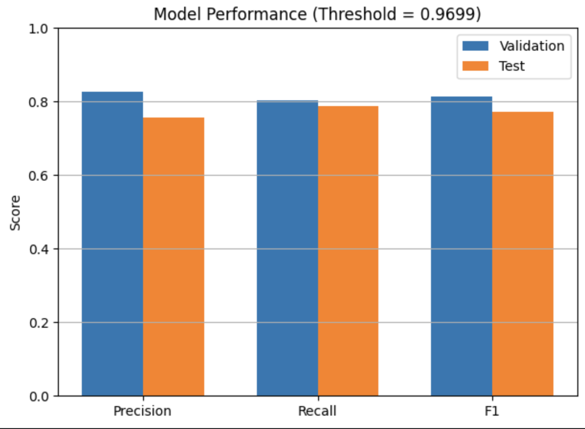
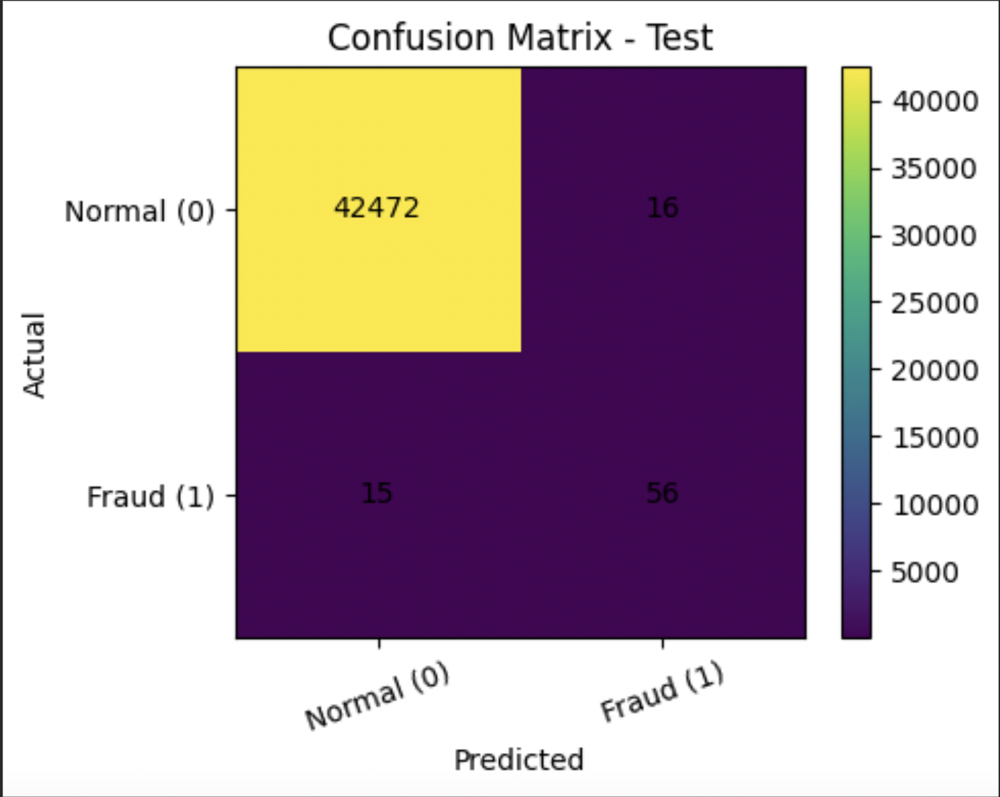
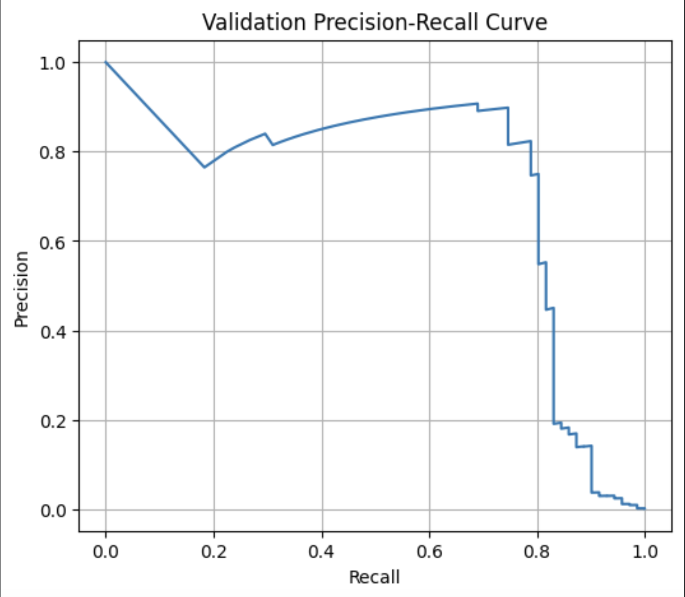
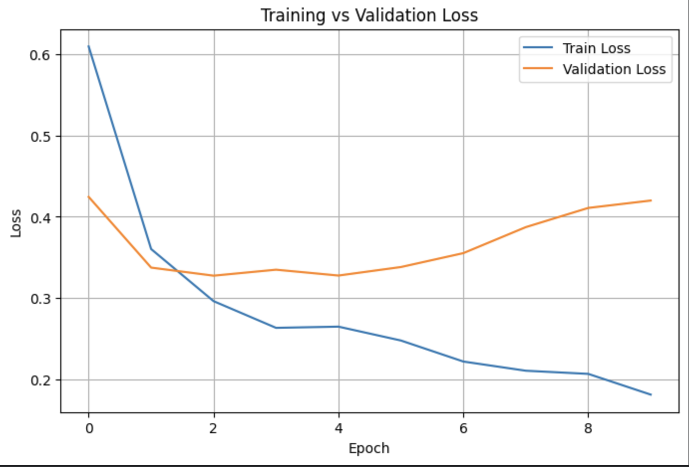

# Credit Card Fraud Detection using Autoencoder (Deep Learning)

## Project Overview
This project focuses on detecting fraudulent credit card transactions using unsupervised anomaly detection with a Deep Learning Autoencoder implemented in PyTorch.

Due to the highly imbalanced nature of fraud data, the model is trained only on normal (non-fraud) transactions to learn their underlying patterns. Transactions that result in a high reconstruction error are flagged as potential fraud.

---

## Objectives
- Detect anomalous (fraudulent) credit card transactions  
- Apply Deep Learning techniques for unsupervised anomaly detection  
- Handle extreme class imbalance in fraud datasets  
- Evaluate model performance using reconstruction error and thresholding  

---

## Model Used
### Autoencoder Neural Network
- Fully connected (MLP-based) architecture  
- Trained exclusively on normal transactions  
- Uses reconstruction error to detect anomalies  

---

## Dataset
- Dataset: Credit Card Transactions Dataset  
- Source: Public dataset (e.g., Kaggle)  
- Features: Numerical features (V1–V28), Amount, Time  
- Labels:  
  - 0 → Normal transaction  
  - 1 → Fraudulent transaction  

Fraud cases are highly imbalanced compared to normal transactions.

---

## Project Pipeline
1. Data loading  
2. Data preprocessing and normalization  
3. Splitting normal vs fraud data  
4. Training the autoencoder on normal transactions  
5. Calculating reconstruction error  
6. Threshold selection  
7. Fraud detection  
8. Model evaluation  

---

## Technologies & Tools
- Python  
- PyTorch  
- NumPy  
- Pandas  
- Scikit-learn  
- Matplotlib / Seaborn  
- Jupyter Notebook / Google Colab  

---

## Threshold Selection
Fraud is detected when the reconstruction error exceeds a selected threshold.

The threshold is determined based on:
- Distribution of reconstruction errors  
- Validation set performance  
- Trade-off between precision and recall  

---

## Evaluation Metrics
- Accuracy  
- Precision  
- Recall  
- F1-score  
- Confusion Matrix  

Accuracy alone is not sufficient due to the highly imbalanced nature of the dataset.

---

## Results
- The model successfully learns normal transaction patterns  
- Fraudulent transactions exhibit significantly higher reconstruction error  
- The autoencoder is effective for anomaly detection in highly imbalanced datasets  

### Model Performance

### Confusion Matrix – Validation

### Confusion Matrix – Test

### Precision–Recall Curve

---

## Training Behavior

Training loss decreases consistently while validation loss increases slightly after several epochs, indicating mild overfitting.

---

## Deployment (Prototype Interface)
A prototype interface was developed to simulate real-time fraud prediction using the trained Autoencoder model.
The interface processes transaction inputs through the trained model and generates fraud predictions based on the selected reconstruction error threshold.
This deployment was implemented for demonstration and educational purposes.
---

## Team Members
- Sultanah Alotaibi  
- Layan Alshehri  
- Leen Alqahtani  

